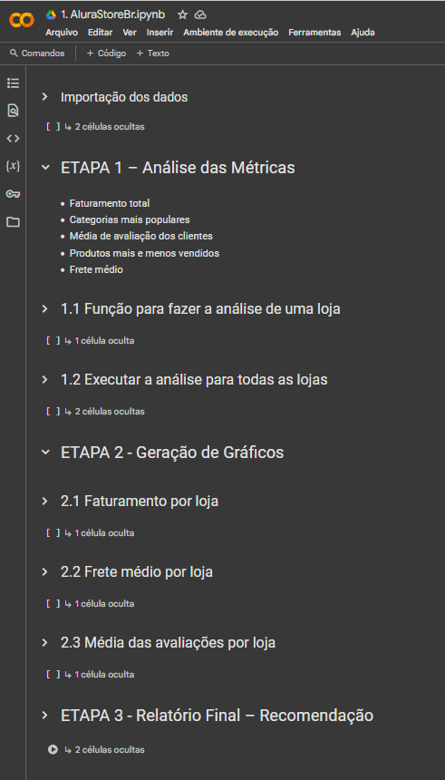

# Desafio ALURA: Aplicacao pratica do conhecimento do Google Colab em Python para Data Science

## ✨ Título
**Análise de Venda e Desempenho da Loja**

## 🌟 Objetivo
Decidir qual das quatro lojas da rede Alura Store deve ser vendida, com base em uma análise de desempenho, para que o Sr. João possa investir em um novo negócio.

## 🏢 Cenário
O Sr. João é dono de uma rede com quatro lojas que operam no e-commerce **Alura Store**. Para obter capital e investir em um novo projeto, ele pretende vender a loja com pior desempenho. A tarefa do desafio é, como analista de dados, **avaliar o desempenho das lojas** e **recomendar qual deve ser vendida** com base em dados concretos.

## ✅ Etapas da Solução
### ETAPA 1: Análise de métricas
- Faturamento total de cada loja
- Categorias mais populares
- Média de avaliação dos clientes
- Produtos mais e menos vendidos (Top 5)
- Custo médio do frete

### ETAPA 2: Geração de gráficos
Foram gerados **3 gráficos diferentes** usando a biblioteca **matplotlib**:
1. Gráfico de barras verticais: Faturamento por loja
2. Gráfico de barras horizontais: Custo médio do frete por loja
3. Gráfico de pizza: Distribuição da média das avaliações por loja

### ETAPA 3: Relatório final dinâmico no Google Colab
Foi criado um relatório final automático, gerado com base nos dados reais analisados e em variáveis dinâmicas que apontam qual loja tem o pior desempenho.

---

## ⚡ Tecnologias, Bibliotecas e Recursos Utilizados
- **Python**: linguagem principal para análise de dados
- **Pandas**: manipulação e análise de dados tabulares
- **Matplotlib**: criação dos gráficos de visualização de dados
- **Google Colab**: ambiente de execução interativa, gratuito e acessível via navegador

---

## 🔧 Funcionalidades e Lógica da Aplicação

### Python na Prática:
1. **Variáveis**: usadas para armazenar os dados de cada loja, faturamentos, médias, etc.
2. **Condicionais** (`if`, `else`): determinam lógicas de decisão para interpretação dos dados.
3. **Funções**: organizam códigos reutilizáveis para leitura de dados, cálculos e impressão de relatórios.
4. **Listas e Laços (`for`)**: percorrem as lojas para realizar análises em lote, como somas, médias e visualizações.

---

## 🚀 Superando desafios
- **Problemas com variáveis no formato de tupla**: Ao tentar acessar dados numéricos, foi identificado que estavam encapsulados em tuplas. A solução foi revisar o código de geração das listas e extrair corretamente os valores.
- **Visualizações sem legenda clara**: O gráfico de pizza foi ajustado com labels e título informativo para facilitar a compreensão.
- **Relatório estático**: Tornamos o relatório final dinâmico, usando variáveis que se atualizam conforme os dados.

---

## 🌐 Como usar
1. Acesse o arquivo `.ipynb` no Google Colab
2. Execute as células de forma sequencial
3. Visualize os gráficos gerados automaticamente
4. Confira o relatório final baseado nos dados analisados

---

## 📸 Print do projeto rodando no Google Colab

---

## 🔹 Conclusão
O projeto mostra de forma clara como uma análise simples e estruturada pode gerar valor prático e tomar decisões de negócio. A loja com pior desempenho é identificada de forma objetiva, permitindo ao Sr. João agir com segurança.

---

> Desenvolvido como parte do desafio prático da **Alura** para aplicação de conhecimentos de **Python para Data Science**.

---

Se quiser me acompanhar nos estudos ou contribuir com melhorias, fique à vontade para abrir um PR ou issue neste repositório! 🚀

